# LED-Kurokku Architecture

This document describes the overall architecture of the LED-Kurokku system and how the different components interact.

## System Components

The LED-Kurokku system consists of the following main components:

1. **led-kurokku**: Core application that controls TM1637 LED displays
2. **kurokku-cli**: Command-line management tool for configuring multiple LED-Kurokku instances
3. **Redis**: Central data store and communication hub between components
4. **Weather APIs**: External data sources (OpenWeather API and NOAA) for weather data

## System Diagram

```mermaid
graph TD
    %% Main applications
    CLI[kurokku-cli]
    LED[led-kurokku]
    RedisDB[(Redis Database)]
    OpenWeather[OpenWeather API]
    NOAA[NOAA Weather API]
    
    %% CLI Subcommands
    CLI_Instances[Instances Management]
    CLI_Config[Configuration Management]
    CLI_Template[Templates Management]
    CLI_Alert[Alert Management]
    CLI_Weather[Weather Management]
    
    %% CLI -> Subcommands
    CLI --> CLI_Instances
    CLI --> CLI_Config
    CLI --> CLI_Template
    CLI --> CLI_Alert
    CLI --> CLI_Weather
    
    %% External Services
    CLI_Weather --> OpenWeather
    CLI_Weather --> NOAA
    
    %% Redis interactions
    CLI_Instances --> RedisDB
    CLI_Config --> RedisDB
    CLI_Alert --> RedisDB
    CLI_Weather --> RedisDB
    
    %% LED-Kurokku Components
    LED_Core[Core LED Controller]
    LED_Widgets[Widget System]
    LED_TM1637[TM1637 Driver]
    
    %% LED-Kurokku structure
    LED --> LED_Core
    LED_Core --> LED_Widgets
    LED_Core --> LED_TM1637
    
    %% Widget Types
    Widget_Clock[Clock Widget]
    Widget_Alert[Alert Widget]
    Widget_Message[Message Widget]
    Widget_Animation[Animation Widget]
    
    %% Widget connections
    LED_Widgets --> Widget_Clock
    LED_Widgets --> Widget_Alert
    LED_Widgets --> Widget_Message
    LED_Widgets --> Widget_Animation
    
    %% LED-Kurokku and Redis
    LED <--> RedisDB
    
    %% Weather data flow
    CLI_Weather -- "Temperature Data" --> RedisDB
    CLI_Weather -- "Alerts" --> RedisDB
    CLI_Weather -- "Sunrise/Sunset Data" --> RedisDB
    
    %% Configuration flow
    LED -- "Reads Configuration" --> RedisDB
    LED -- "Reads Alerts" --> RedisDB
    LED -- "Reads Weather Data" --> RedisDB
    
    %% Physical Hardware
    TM1637[TM1637 LED Display]
    LED_TM1637 --> TM1637
    
    %% Styling
    classDef apiNode fill:#f9f,stroke:#333,stroke-width:2px;
    classDef redisNode fill:#ff9,stroke:#333,stroke-width:2px;
    classDef appNode fill:#9cf,stroke:#333,stroke-width:2px;
    classDef hwNode fill:#fcb,stroke:#333,stroke-width:2px;
    
    class OpenWeather,NOAA apiNode;
    class RedisDB redisNode;
    class CLI,LED appNode;
    class TM1637 hwNode;
```

## How It Works

### Data Flow

1. **Configuration Management**:
   - The CLI tool manages configuration for multiple LED-Kurokku instances
   - Configurations are stored in Redis under the key `kurokku:config`
   - Each LED-Kurokku instance reads its configuration from Redis

2. **Weather Data**:
   - The CLI tool's weather service fetches data from OpenWeather API and NOAA
   - Temperature data is stored in Redis under keys `kurokku:weather:temp:{location_name}`
   - Weather alerts are stored under keys `kurokku:weather:alert:{location_name}:{alert_id}`
   - Sunrise/sunset data from OpenWeather API is used to adjust the display brightness

3. **Alerts**:
   - Custom alerts can be sent via the CLI tool
   - Alerts are stored in Redis under keys `kurokku:alert:{alert_id}`
   - The LED-Kurokku instance displays alerts based on priority and timestamp

### Redis Keys

| Key Pattern | Description |
|-------------|-------------|
| `kurokku:config` | Main configuration for the LED-Kurokku instance |
| `kurokku:alert:*` | Alert messages to be displayed |
| `kurokku:weather:temp:*` | Weather temperature data |
| `kurokku:weather:alert:*` | Weather alerts from NOAA |
| `kurokku:channel:*` | Control channels for messaging |

### LED-Kurokku Widget System

The LED-Kurokku application uses a widget system to display different types of content:

1. **Clock Widget** - Displays time in various formats
2. **Alert Widget** - Displays alert messages
3. **Message Widget** - Displays static or scrolling text
4. **Animation Widget** - Displays animated sequences

The system cycles through enabled widgets based on their configuration.

## Automatic Brightness Adjustment

The system automatically adjusts the brightness of the LED display based on sunrise and sunset times:

1. The CLI tool fetches sunrise/sunset data from OpenWeather API
2. This data is used to update the brightness settings in the LED-Kurokku configuration
3. During daylight hours (between sunrise and sunset), the display uses high brightness
4. During nighttime hours, the display uses low brightness

This ensures optimal visibility in all lighting conditions while conserving power.